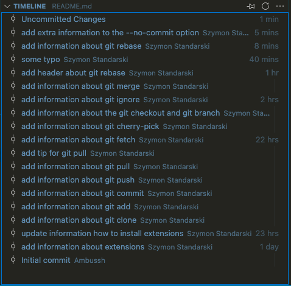
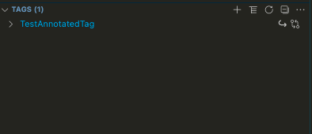

> fat-thursday-7
# Jak być GIT z VSCode?

## Czego potrzebujemy do optymalnej pracy z GIT'em w VSCode?
### [**GITLense**](https://marketplace.visualstudio.com/items?itemName=eamodio.gitlens)

>GitLens supercharges the Git capabilities built into Visual Studio Code. It helps you to visualize code authorship at a glance via Git blame annotations and code lens, seamlessly navigate and explore Git repositories, gain valuable insights via powerful comparison commands, and so much more.

### [**GIT Graph**](https://marketplace.visualstudio.com/items?itemName=mhutchie.git-graph)


>View a Git Graph of your repository, and easily perform Git actions from the graph. Configurable to look the way you want!

### [**GIT History**](https://marketplace.visualstudio.com/items?itemName=donjayamanne.githistory) 


>Git History, Search and More (including git log)

[*Instrukcja jak zainstalować wtyczki w VSCode.*](https://code.visualstudio.com/docs/editor/extension-marketplace)

---

## Praca z podstawowymi poleceniami- czyli to czego używamy najczęściej

### `git clone`

Można wybrać tryb klonowania prosto z podanego URL'a bądz jeśli wybierzemy opcję GitHub i sparujemy nasz VSCode z kontem na Githubie, będziemy mogli klonować repozytoria które są na naszym koncie. 
Warto wspomnieć w tym miejcu o wtyczce [GitHub Pull Requests and Issues](https://marketplace.visualstudio.com/items?itemName=GitHub.vscode-pull-request-github) dzięki której możemy przeglądać i zarządzać GitHubowymi pull requestami bezpośrednio z poziomu VSCode. Istnieje także jej odpowiednik dla BitBucketa [Jira and Bitbucket](https://marketplace.visualstudio.com/items?itemName=Atlassian.atlascode)

### `git add`

Zmiany jakie chcemy zacommitować wybieramy w panelu *Source Control*. Możemy dodawać do commita całe pliki lub wybrać tylko te linnie kodu które nas interesują -> w tym celu wyświetlamy *working tree* w exploratorze, zaznaczamy interesującą nasz część i z menu kontekstowego wybieramy `Stage Selected Ranges` (lub używamy skrótu klawiaturowego *CMD + K ALT + CMD + S*). Możemu tutaj także odznaczyć kod który nas nie interesuje, albo cofnąć nasze zmiany. 

Istnieje jeszcze możliwość *stagowania* zmian bezpośrednio w edytowanym pliku -> więcej o tym będzie przy **rewizji**. 

Ekwiwalent tych opcji to polecenie 
```properties
git add --patch
```

### `git commit`
Polecenie `git commit` możemy wywołać bezpośrednio z *command palette* (mamy tam kilka opcji), oraz takzę w panelu `Source control`. 

### `git push`

Polecenie `git push` wywołujemy z *command palette*. Mamy tutaj kilka opcji. Najlepszą jest `GitLense: Push`. Po jej wybraniu będziemy widzieć ile commitów zostanie wypchniętych do naszego serwera. Dodatkowo mamy możliwość wyboru *zwykłego* pusha bądz też z opcją `--force-with-lease`

>`--force-with-lease` is a safer option that will not overwrite any work on the remote branch if more commits were added to the remote branch (by another team-member or coworker or what have you). It ensures you do not overwrite ,meone elses work by force pushing.

Możemy także zrobić pusha dla brancha na którym już nie jesteśmy. W tym celu przechodzimy na panel **GitLense** i w zakładce *Branches* odnajdujemy interesujący nas branch. Tam klikamy ikonę ze strzałką skierowaną ku górze.

### `git pull`

W przypadku polecenia `git pull` mamy taką samą sytuację jak z `push`'em. Polecenie wywołujemy z *command palette*. Mamy tutaj kilka opcji. Najlepszą jest `GitLense: pull`. Po jej wybraniu zostaniemy poinformowani ile commitów zostanie pobranych do naszego brancha. Dodatkowo, mamy możliwość wybrania opcji `--rebase`.


>zwykłe `git pull` to tak naprawdę połączenie dwóch poleceń: `git fetch & git merge`. Wywołanie tego polecenia powoduje pobranie zmianych z zdalnego brancha i stworzenie nowego *merge commit'u*

> `git pull --rebase` wykonuje `git fetch & git rebase`, efektywnie przenosząc nasze zmiany na "czubek" zmian ze zdalnego brancha. 

#### TIP
Ustawienie globalnej opcji
```properties
git config --global pull.rebase true
```
spowoduje że wszystkie nasze pulle będą domyślnie z opcją `--rebase`;

### `git fetch`

Polecenie `git fetch` wywołujemy z *command palette*. Niestety tutaj nie mamy zbyt wielu opcji.


### `git cherry-pick`

*Cherry-pick'a* możemy zrobić bezpośrednio z *command palette*, gdzie mamy możliwość, najpierw wybrania brancha a następnie wskazania commitu który nas interesuje lub też bezpośrednio podając id. 
Możemy go także wykonać na grafie w *Git Graph*. Odnajdujemy interesujący nas commit i z menu kontekstowego wybiermy `Cherry pick...`. W okienku które się pojawi mamy dwie dodatkowe flagi które możemy oznaczyć. Tj. :
- `No commit` - nie tworzy nam bezpośrednio nowego commita. Przydatne jeśli chcemy wziąć więcej commitów.
- `Record origin` - dodaje tekst *cherry-picked from commit ...* do oryginalnej wiadomości. Jeśli cherry-pickujemy z prywatnego brancha to ta informacja jest totalnie zbędna dla pozostałych użytkowników naszego repozytorium więce lepiej jej nie dodawać. 

Cherry-picka możemy także wykonać w zakładce *Git Lense*. Na liście branchy wskazujemy interesujący nas commit i z menu kontekstowego wybieramy `Cherry Pick Commit...`. Tutaja mamy te same opcje co w przypadku cherry-picka wywołanego z *command palette*.

### `git checkout` i `git branch`
Mamy wiele możliwości aby utworzyć nowy brach lub przełączyć się na już isteniejący:
1. Możemy tego dokonać w panelu *GITLENS* 
2. Możemy posłużyć się menu kontestowym w *Git Graph*
3. Ale najłatwiejszą opcją będzie wywołanie polecenia z *command palette*. 

### `git ignore`
Jeśli chcecie szybko dodać jakiś plik do *.gitignore*, wystarczy go otworzyć i wywołać polecenie `Git: Add to .gitignore`. 

### `git merge`

W celu wykonania `marga`, podobnie jak w przypadku wielu innych poleceń mamy kilka opcji do wyboru.
1. Możemy się posłużyć zakładką *GitLense* i tam w panelu *BRANCHES* możemy z menu kontekstowego możemy wybrać opcję `Merge Branch into Current Branch...` 
2. W panelu *Git Graph* z menu kontekstowego możemy wybrać `Merge into current branch...`
3. Ponownie najlepszą i najłatwiejszym sposobem jest posłużenie się *command palette*. Wybieramy opcję *GitLense: Git merge...*. Po wybraniu interesującego nas brancha, mamy kilka opcji do wyboru: 

- `--ff-only` utworzy fast-forward merga
- `--squash` połączy nam wszystkie commity do jednego i go zmerguje
- `--no-ff` nie zrobi fast-forwardingu
- `--no-ff --no-commit` zrobi merga bez FF i bez commitu mergującego (bedziemy musieli go sami wywołać)

### `git rebase`

Rebase jest bardzo użyteczne i z opcją `--interactiv` umożliwia nam bardzo wiele.
VSCode i wtyczka GitLense pozwalają nam jeszcze lepiej i "przyjemniej" zarządzać rebasem. W tym celu należy zmienić globalną konfigurację git'a dla domyślnego edytora. Oczywiście GitLense nam to ułatiwa i w _command palette_ należy jedynie wywołać polecenie `GitLense: Enable Interactiv Rebase Editor`

Od teraz gdy wywołamy rebase z opcją `-interactiv` naszym oczom powiniem ukazać się taki widok:


Krótki wyjaśnienie poszczególnych poleceń:

- pick = use commit
- reword = use commit, but edit the commit message
- edit = use commit, but stop for amending
- squash = use commit, but meld into previous commit
- fixup = like "squash", but discard this commit's log message
- drop = remove commit

## Łooooo Panie, a kto Panu tutaj tak sp*******?

### File history
File history w panelu *GitLense*


File history z nie wypchniętymi commitami:


Timeline:



File history z dodatku GitHistory:


### Folder history
Ciekawą opcją (chociaż żadziej stosowaną) jest wyświetlanie histori katalogu. W exploratorze, po wybraniu interesującego nad folderu z menu kontekstowego wybieramy opcję `Open Folder History`.


### Line History


### File blame


Panel *File Blame* możemy włączyć na cztery sposoby:
1. Pierwszy, naprostrzy to skróty klawiaturowy ALT + CMD + G  B
2. Drugi to wybranie opcji *File Blame* w górnym pasku nawigacyjnym  
3. Trzeci to wywołanie z *command palette* opcji `GitLense: Toggle File Blame`
4. Czwarta opcja to kliknięcie na autora pliku, funkcji lub linii 


### File Heatmap

Pokazuje obszary w których zmiany są najczęstsze:


Włączamy z *command palette* oraz z górnego paska nawigacyjnego.


Im kolor bardziej czerwony tym zmany były częstsze. 

### Revision

GitLens daje nam bardzo fajne narzędzie do wykonaywania rewizji plików. 
W celu szybkiego podglądu zmian jakie były wprowadzone w obecnie otwartym pliku należy:
- posłużyć się skrótem klawiaturowym CMD + ALT + G ,  
- w górnym pasku nawigacyjnym kliknąć ikonę kółka ze strzałką skierowaną w lewą stronę: 


## Extras

### Lista kontrybutorów
W GitLens mamy możliwość podejrzenia wszystkich kontrybutorów naszego repozytorium:


### Git Graph - ustawienia


### Git Tags 

Panel tagów w zakładce GitLense:



Usuwanie tagów za pomocą wtyczki GitLense, z panelu *command palette*:


### Git Stash 

Panel stashes w zakładce GitLense:


Polecenia związane z git stash, dostępne w *command palette*.


## Let's make command line greate again!

Git jest bardzo podtężnym narzędziem. A wszystkie opcjie które do tej pory zostały zaprezentowane, tak na prawdę odwołują się do prostych poleceń które możemy wywołać bezpośrednio w command line.


### Aliasy

Wyświetlenie wszystkich aliasów:
```sh
git config --list | grep alias
```


lub możemy najpierw utworzyć alias to wyświetlania listy aliasów :):
```sh
git config --global alias.alias "! git config --list | grep 'alias\.' | sed 's/alias\.\([^=]*\)=\(.*\)/\1\	 => \2/' | sort"
```

a następnie ją wyświetlić:
```sh
git alias
```


### Logi

Uproszczony graph
```sh
git log --color --graph --pretty=format:'%C(bold white)%h%Creset -%C(bold green)%d%Creset %s %C(bold green)(%cr)%Creset %C(bold blue)<%an>%Creset' --abbrev-commit --date=relative
```

Tworzymy alias `git lg`:
```sh
git config --global alias.lg "log --color --graph --pretty=format:'%C(bold white)%h%Creset -%C(bold green)%d%Creset %s %C(bold green)(%cr)%Creset %C(bold blue)<%an>%Creset' --abbrev-commit --date=relative"
```

Graph z dodatkowymi informacjami:
```sh
git log --color --graph --pretty=format:'%C(bold white)%H %d%Creset%n%s%n%+b%C(bold blue)%an <%ae>%Creset %C(bold green)%cr (%ci)' --abbrev-commit
```

Tworzymy alias `git llg`:
```sh
git config --global alias.llg "log --color --graph --pretty=format:'%C(bold white)%H %d%Creset%n%s%n%+b%C(bold blue)%an <%ae>%Creset %C(bold green)%cr (%ci)' --abbrev-commit"
```

### Lazygit

https://github.com/jesseduffield/lazygit


### GFC


